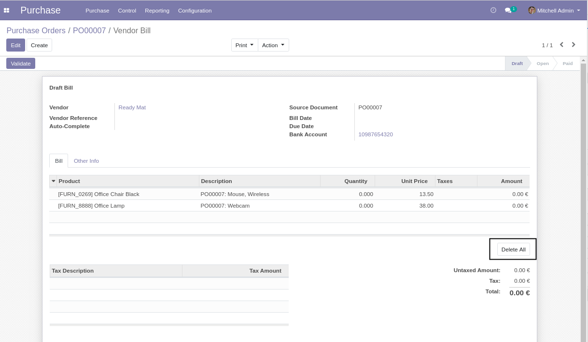
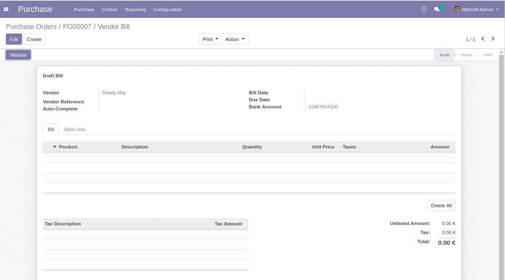

Purchase Invoice Empty Lines
============================
This module allows to empty all lines from a supplier invoice.

.. contents:: Table of Contents

Usage
-----
As member of ``Accounting / Billing``, I go to the form view of a draft supplier invoice.

I notice a new button ``Delete All``.

I click on the button.

I notice that all lines were deleted and the origin document was emptied.

Contributors
------------
* Numigi (tm) and all its contributors (https://bit.ly/numigiens)
