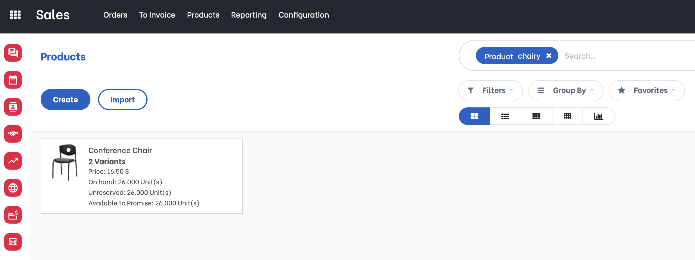

Product Supplier Name Search
============================
This module improves the default name search of a product.

It enables searching the product by the supplier's product name and code from a related field or search bar of a list view.

Configuration
-------------
In the Vendor section of the product, I can define a `Vendor Product Name` and `Vendor Product Code` per supplier.

Usage
-------------

On a sale order, I'm able to search by `Vendor Product Name` or `Vendor Product Code`.

On the product catalog, I am also able to search by `Vendor Product Name` or `Vendor Product Code`.

Contributors
------------
* Numigi (tm) and all its contributors (https://bit.ly/numigiens)

More information
----------------
* Meet us at https://bit.ly/numigi-com
