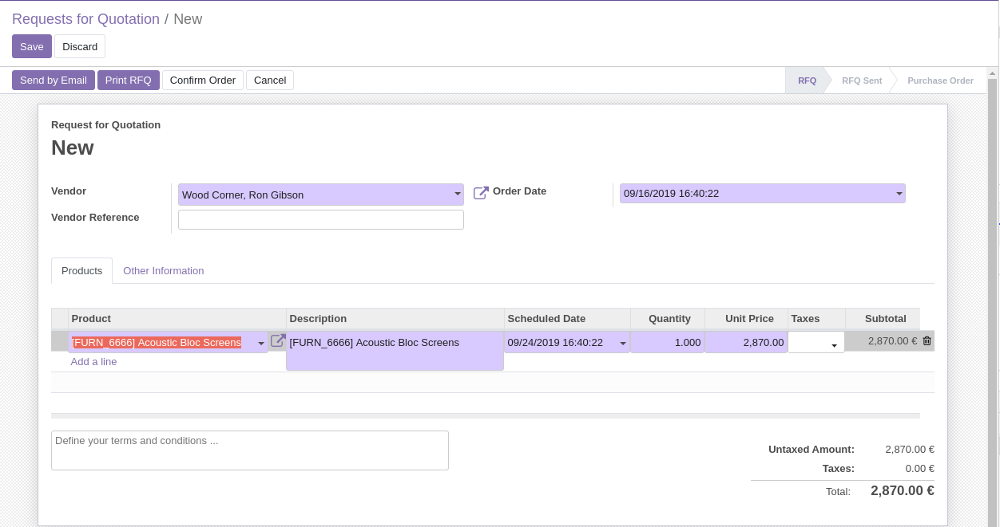

Purchase Consignment
====================
This module improves the usability of consignment in Odoo.

Context
-------
In vanilla Odoo, as of version ``12.0``, managing consignment is error prone.
You must manually define the product owner on each received item in a reception picking.

.. image:: static/description/vanilla_odoo_consignment.png

Summary
-------
This module adds a ``Consignment`` checkbox on products.

If this box is checked, one and only one supplier must be defined in the list of suppliers for this product.

When an item is received, the supplier defined on the PO is automatically set as ``owner``.

A constraint is added to the PO to prevent selecting a wrong supplier with a consigned product.

Configuration
-------------
As member of the group ``Purchase / Manager``, I go to the form view of a product.

I notice a new checkbox ``Consignment``. I check the box.

.. image:: static/description/product_form_consignment.png

In the ``Purchase`` tab, I select the supplier for this product.

..

    Because ``Consignment`` is checked, I can not select more than one supplier (commercial partner).
    However, I can enter more than one address under the same commercial partner.

Usage
-----
As member of the group ``Purchase / User``, I go to the form view of a purchase order.

I select my supplier and the consigned product.

I confirm the purchase order.

.. image:: static/description/purchase_order_confirmed.png

I go to the reception picking.

I notice that the owner was automatically set on the stock move.

.. image:: static/description/reception_picking_with_owner.png

Constraint on PO
----------------
On a purchase order, If I select a wrong supplier for a consigned product, a blocking message will be raised
when confirming the PO.

.. image:: static/description/purchase_order_constraint_message.png

Contributors
------------
* Numigi (tm) and all its contributors (https://bit.ly/numigiens)
