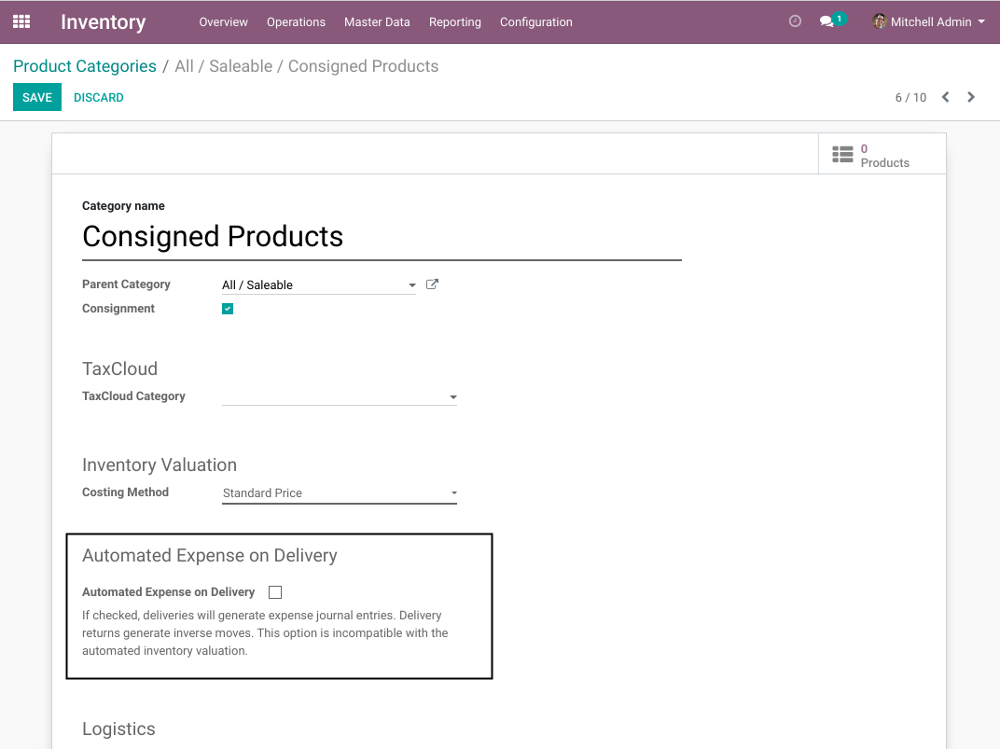
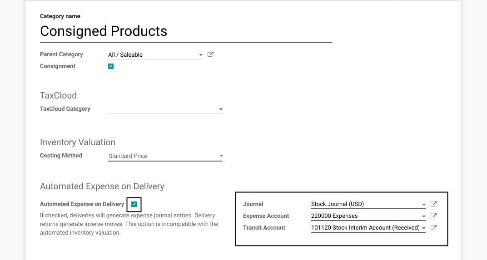
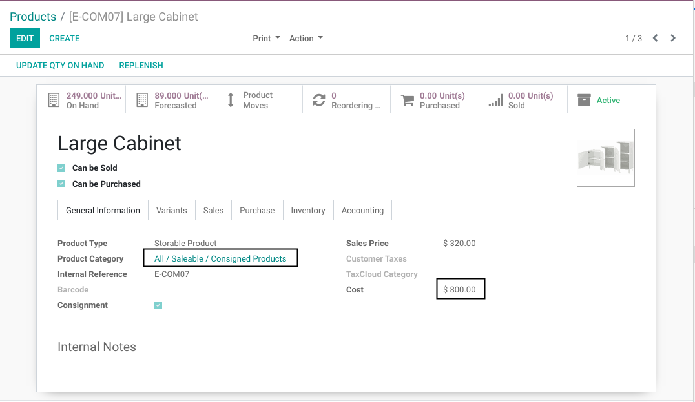
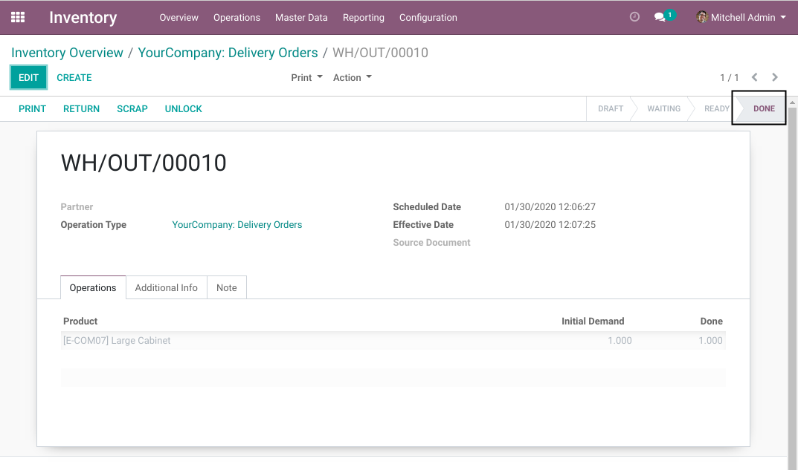
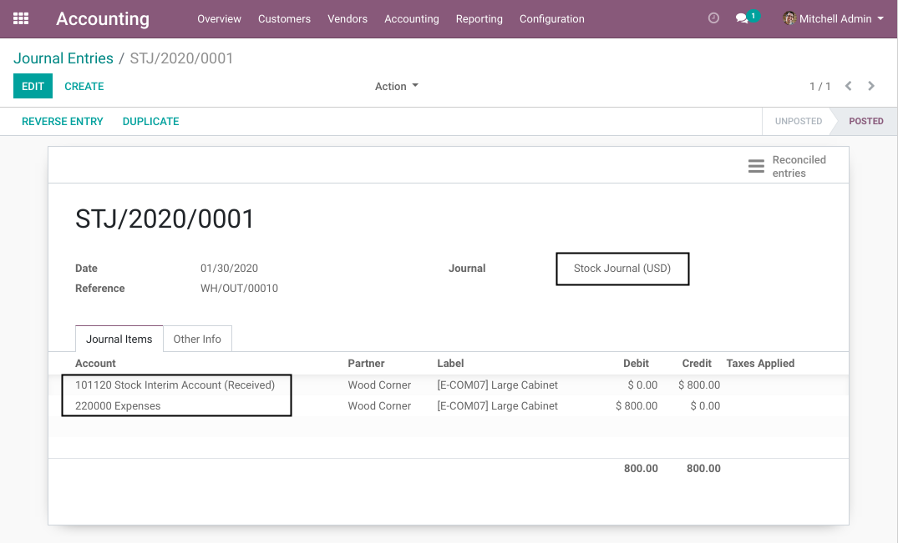

Purchase Consignment Delivery Expense
=====================================
This module extends ``purchase_consignment``.

When delivering a consigned product, a journal entry is created to recognize the cost of the product.

.. contents:: Table of Contents

Context
-------
A consigned product has no inventory value.
Therefore, in vanilla Odoo when delivering the product, no journal entry is created.

If the cost of these products is recognized at the purchase invoice,
the matching of revenues and charges principle is not followed.

Hypothesis
----------
This module is designed based on the asumption that the supplier invoice for a consigned product
is received after the product is sold (delivered).

Module Design
-------------
The global approach in this module is to use a transit account to accrud the cost of delivered products.

This transit account is most likely a current liability.
It is credited when delivering a product.

When the supplier invoice is received, the transit account is debited.

Configuration
-------------
In the form view of a product category, I find a new section ``Automated Expense on Delivery``.

In the section, I find a box that allows to activate the feature for this category.

The feature is only usable if:

* ``Consignment`` is checked
* The cost method is ``Standard Price``
* The inventory valuation is ``Manual``

If I check the box, 3 new fields appear:

* Journal
* Expense Account
* Transit Account

These fields are used for generating the journal entry when delivering a product from this category.

Usage
-----
I setup a product in the ``Consigned Products`` category.

When validating a delivery order for this product, a journal entry is created.

I notice that the journal entry contains the journal and the expense and transit accounts defined on the category.

Known Issues
------------

Supplier Invoice
~~~~~~~~~~~~~~~~
There is for now no constraint or automation on the supplier invoice.

The account selected for the consigned product on the invoice line should be the transit account.

It is the responsibility of the user properly configure the system so that
this account is automatically selected on the invoice.

Standard Price
~~~~~~~~~~~~~~
The standard price (cost) defined on the product is used to compute the expense when delivering the product.

This price may be different from the actual unit price on the supplier invoice.

There is no automation for balancing the transit account in case of an imbalance.

Contributors
------------
* Numigi (tm) and all its contributors (https://bit.ly/numigiens)
