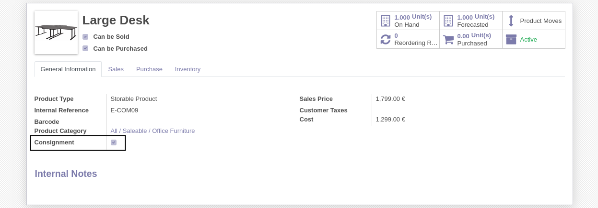
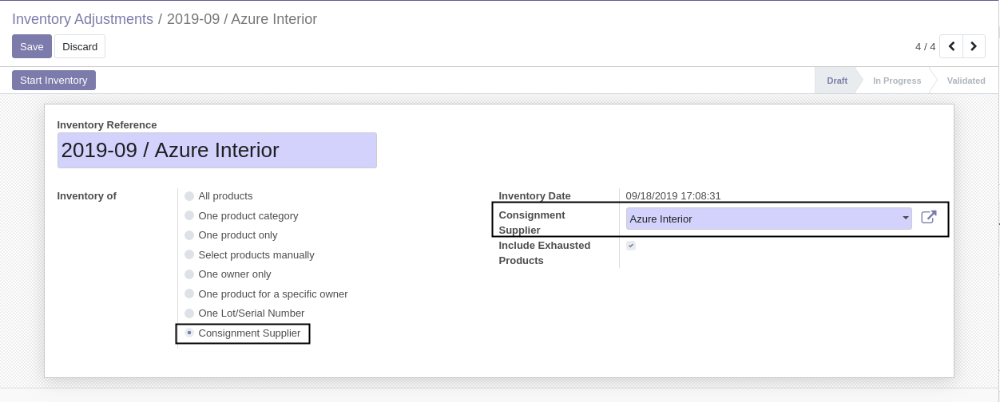
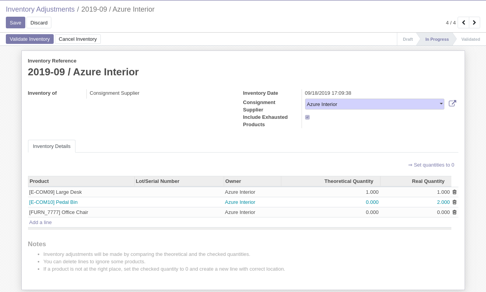
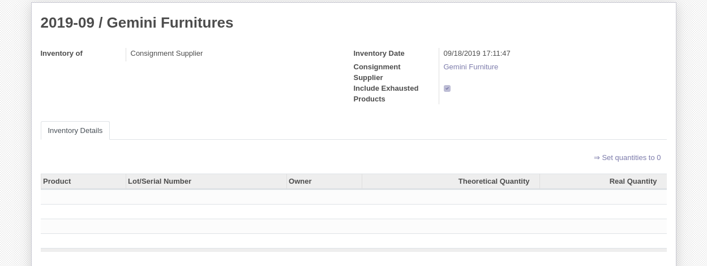

Purchase Consignment Inventory
==============================
This module extends the ``purchase_consignment`` module (from the same repository).

It allows to make an inventory adjustment for all products of a single consignment supplier.

.. contents:: Table of Contents

Configuration
-------------
As ``Inventory / Manager``, I go to the form view of a product.

I check the ``Consignment`` box:

I select a vendor:

.. image:: static/description/product_form_vendor.png

Usage
-----
I create an inventory adjustment. I select ``Consignment Supplier``.

I start the inventory adjusment.

The list of products contains all consigned products of the selected supplier.

Supplier with no Product
------------------------
If a supplier has no consigned product, the inventory line list will be empty.

In such case, no product will be selectable when adding new inventory lines.

Behavior in Details
-------------------
When the inventory is started, the products are searched
based on the ``Consignment`` checkbox and the list of vendors of a product.

The search is not based on the ``Owner`` of a quant.
If a quant has a wrong owner or no owner at all, it will appear (if the product is consigned under the selected supplier).
This is intended to make the system more transparent and help track errors.

If a quant is owned by the selected supplier, but not set as a consigned product for this supplier, it will not appear.

Contributors
------------
* Numigi (tm) and all its contributors (https://bit.ly/numigiens)
