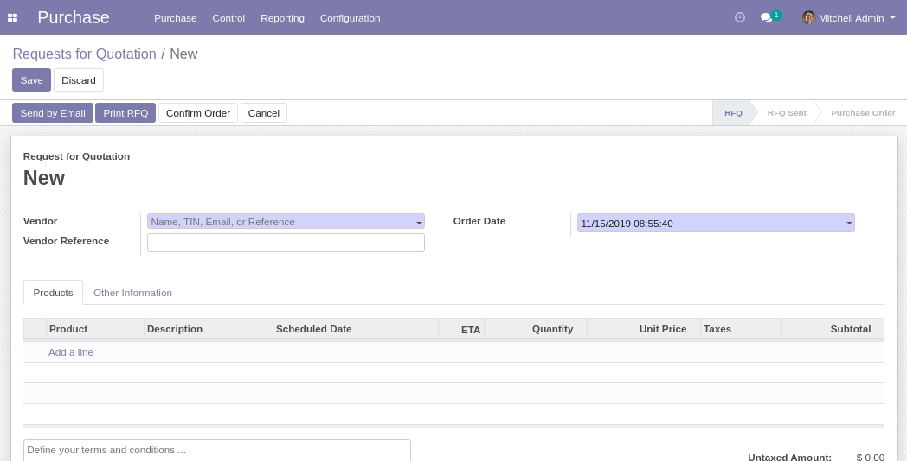
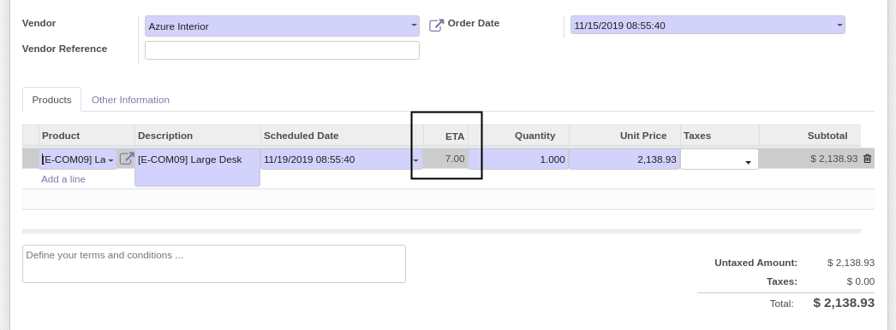
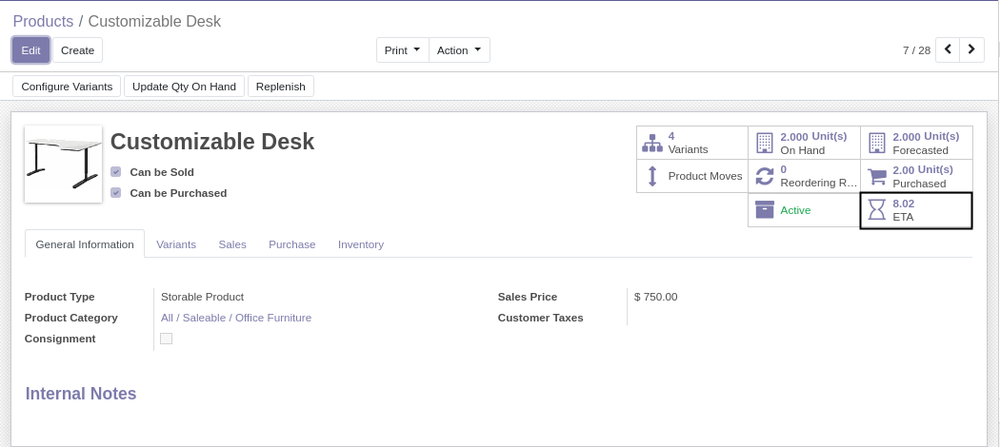

Purchase Estimated Time Arrival
===============================
This module computes estimated time of arrival (ETA) from purchase receipts.

.. contents:: Table of Contents

Purchase Orders
---------------
As member of ``Purchase / User``, I create a new purchase RFQ.

When I select a product, the average ETA for this product is displayed.

Product Smart Button
--------------------
As member of ``Purchase / User``, I go to the form view of a product.

I notice a new smart button ``ETA``.

..

	The number on the button indicates the average ETA for this product.

When I click on the button, I see the list of ETA items computed for this product.

Global ETA List
---------------
As member of ``Purchase / Manager``, I go to ``Purchase / Reporting / ETA``.

I see the global list of ETA (for every product).

.. image:: static/description/global_eta_list.png

Computation of ETA
------------------
When a product is received from a supplier (meaning that the receipt picking is processed),
a new ETA entry is generated.

If a product is received partially, and a backorder is created, an ETA will be created
for both the initial receipt and the second receipt.

The average ETA does not 

Contributors
------------
* Numigi (tm) and all its contributors (https://bit.ly/numigiens)
