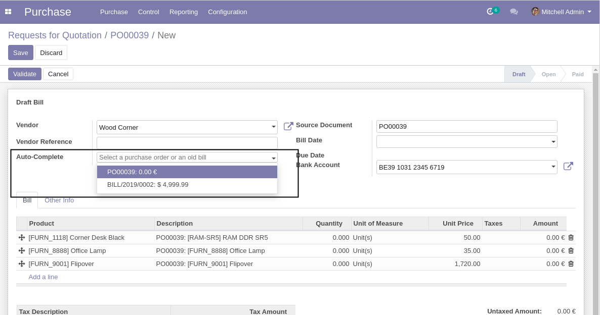
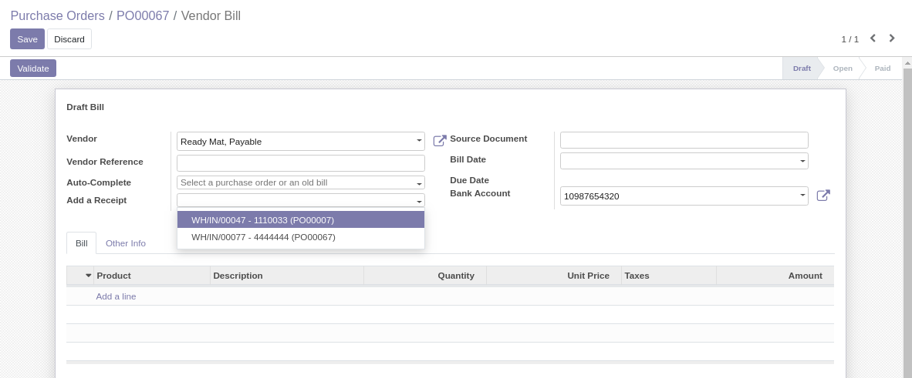
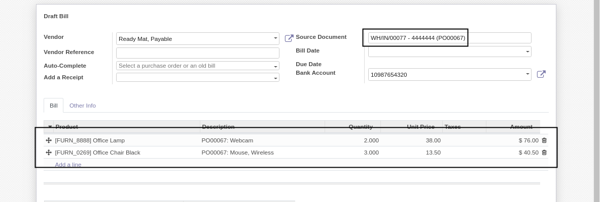
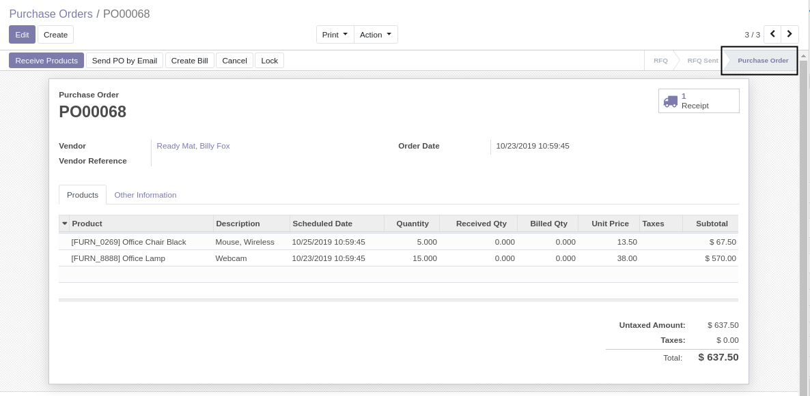
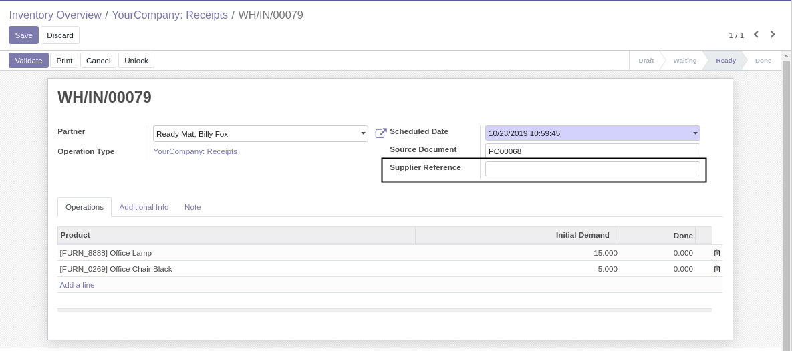
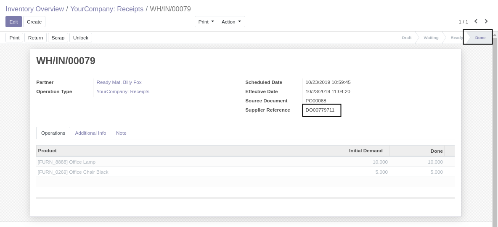
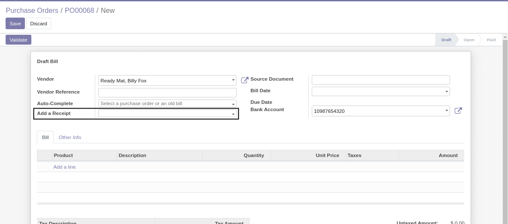
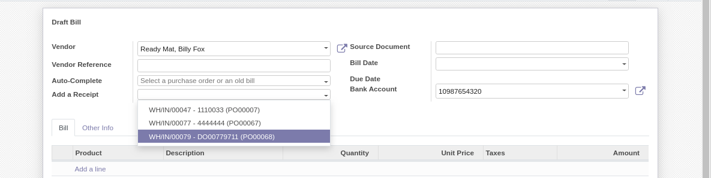
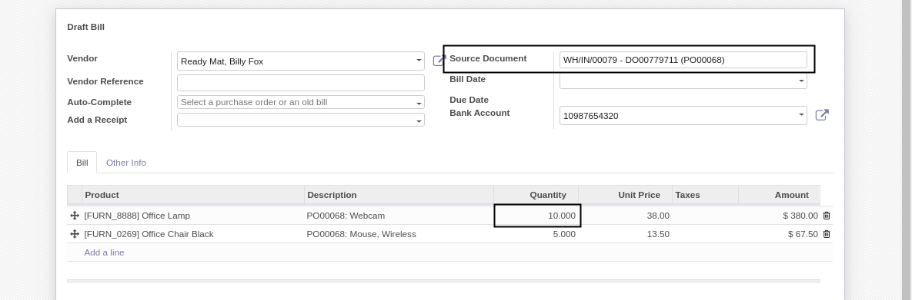

Purchase Invoice From Picking
=============================
This module allows to generate supplier invoice lines from receipt pickings.

.. contents:: Table of Contents

Context
-------
In vanilla Odoo, you may select a PO from a vendor bill by entering the vendor bill reference.

This is convenient if your vendors issues invoices based on a sale orders (your purchase orders).
This is less convenient if your vendor issues invoices based on deliveries.

Overview
--------
This module allows to select a stock picking from a draft invoice.

When the picking is selected, one invoice line is added per stock move.

Each invoice line is properly binded to the origin PO line.

Usage
-----

Purchase Order
~~~~~~~~~~~~~~
As member of ``Purchase / User``, I confirm a PO.

Receipt
~~~~~~~
As member of ``Stock / User``, when the order is received, I navigate to the form view of the picking.

I notice a new field ``Supplier Reference``.

I fill the supplier reference, then validate the receipt.

Note that one product (``[FURN_8888] Office Lamp``) was partially (10 out of 15) received. A backorder was created.

Invoice
~~~~~~~
As member of ``Accounting / Billing``, when the supplier bill is received, I create a draft bill.

I notice a new field ``Add a receipt``.

I select my receipt.

The invoice lines are automatically generated and the origin document was filled.

The quantity on the invoice line is the received quantity from the picking.

Credit Notes / Returns
~~~~~~~~~~~~~~~~~~~~~~
The module also allows to fill a credit note from a return picking.
The behavior is exactly the same as described above for a receipt.

A return picking can also be directly added to an invoice.
In such case, the quantity on the new invoice lines will be negative.
The total amount on the invoice will need to be positive (this is a standard Odoo constraint).

Contributors
------------
* Numigi (tm) and all its contributors (https://bit.ly/numigiens)
