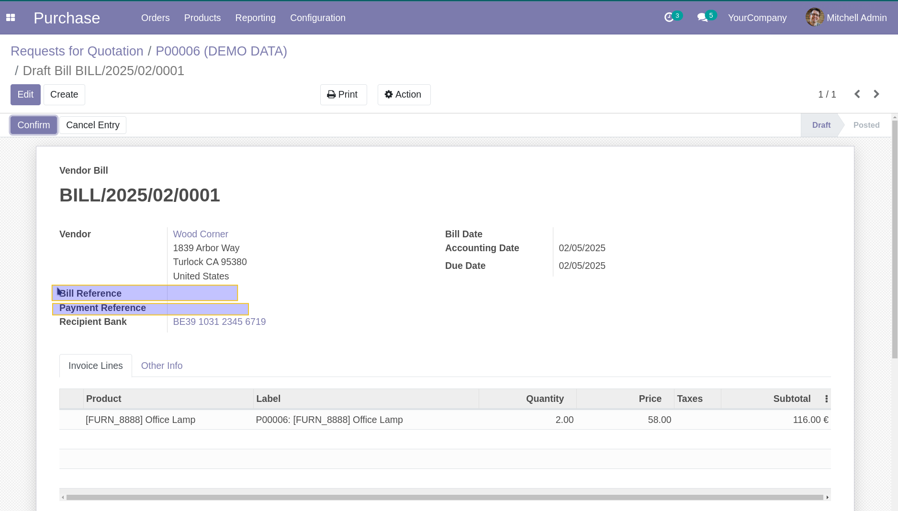

Purchase Invoice Ref Stop Propagate
==================================
This module prevents the automatic propagation of the purchase order reference
to the invoice reference and payment reference when creating an invoice from a purchase order.

By default in Odoo, when creating a vendor bill from a purchase order,
the purchase order reference is automatically copied to:

- The invoice reference field
- The payment reference field

This module disables that behavior, allowing users to manually set the invoice reference.

Before Applying the Module
--------------------------
When creating a vendor bill from a purchase order, the purchase order reference
is automatically copied to the invoice reference and payment reference fields.

After Applying the Module
-------------------------
With this module installed, the invoice reference and payment reference fields
remain empty, preventing automatic propagation from the purchase order.

Contributors
------------
* Numigi (tm) and all its contributors (https://bit.ly/numigiens)
