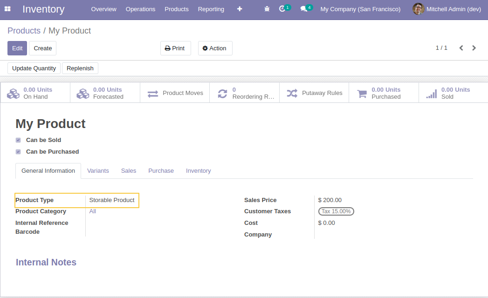
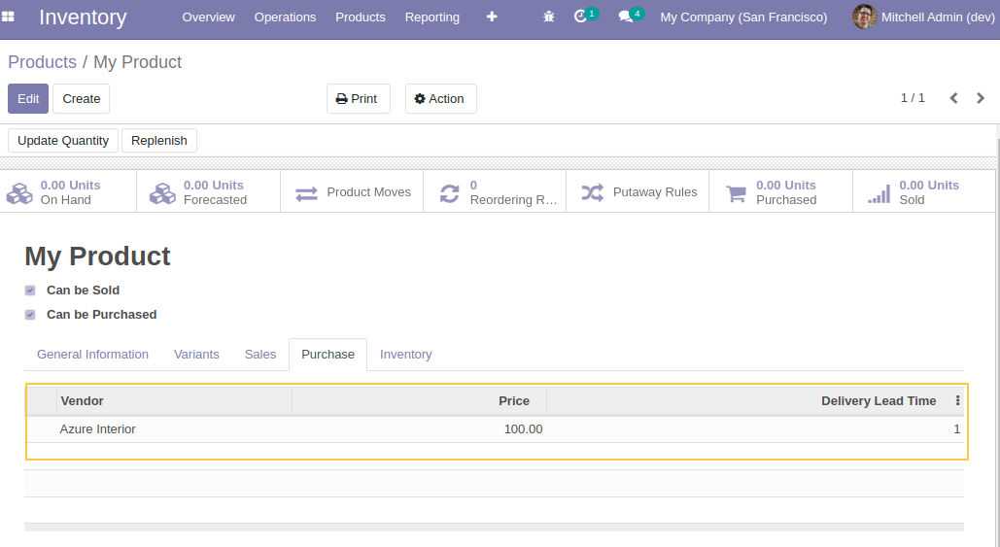
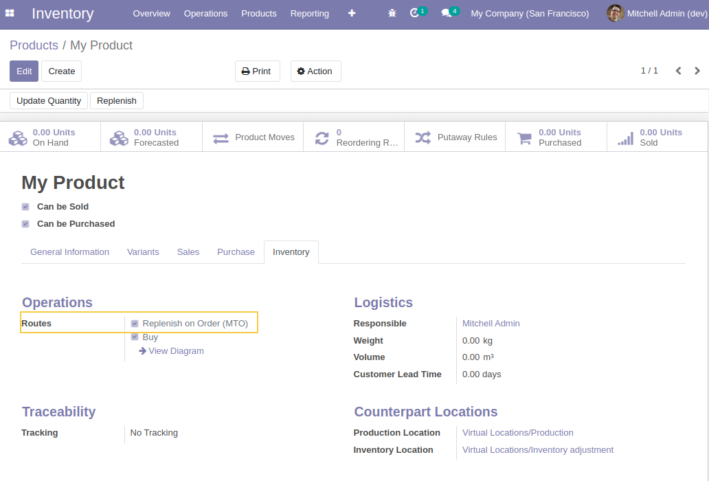
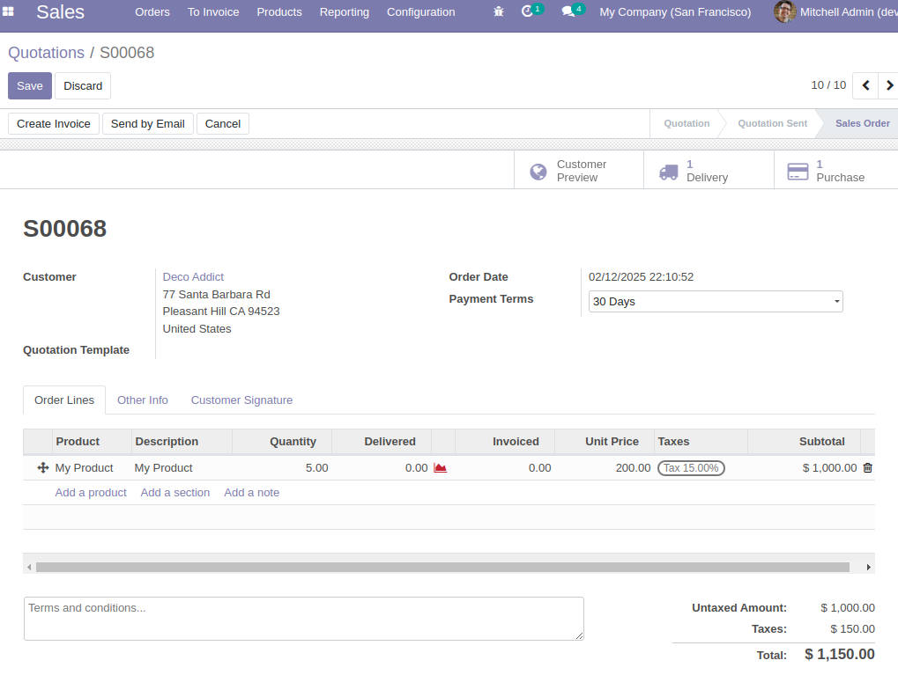
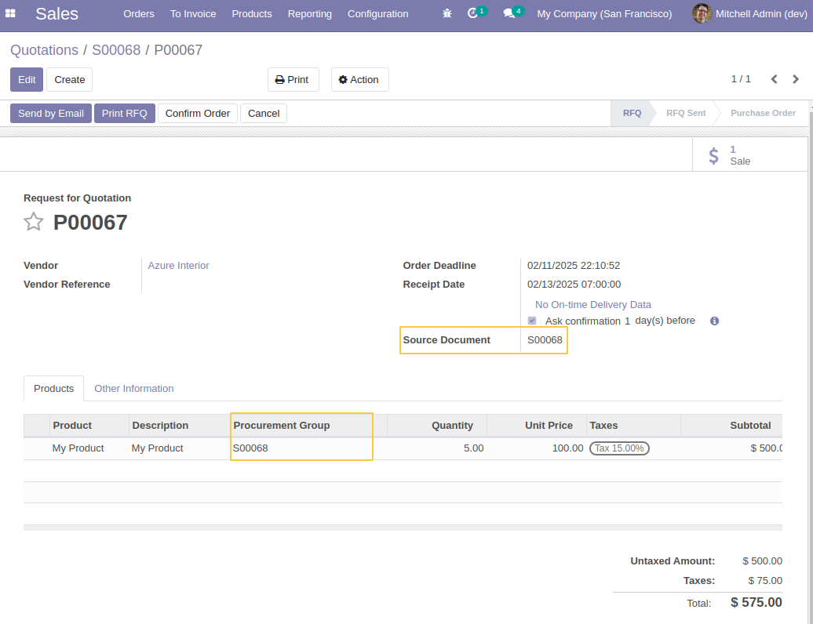
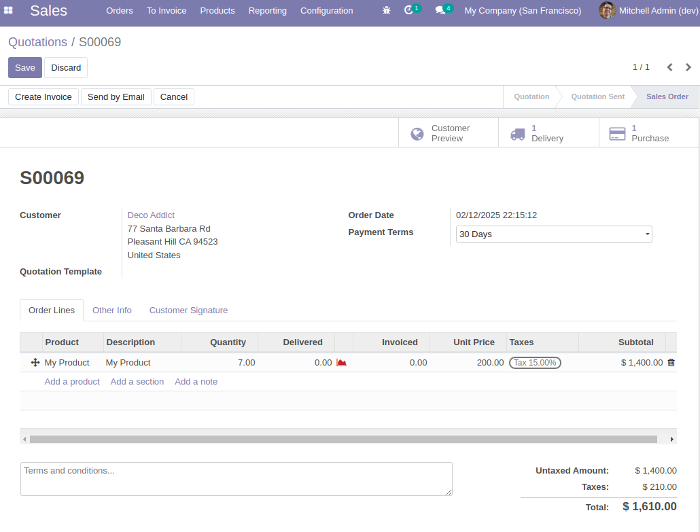
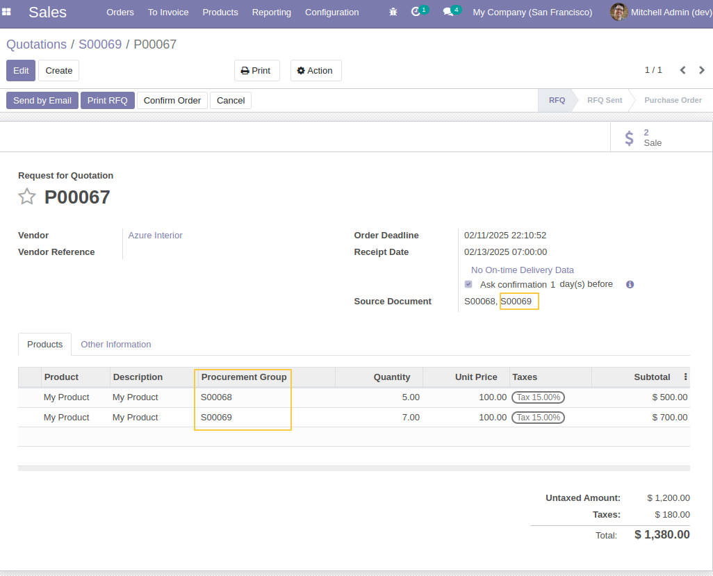

Purchase Line Procurement No Grouping
=====================================

This module prevent grouping purchase order lines coming from different progurement group. 
This module works only for products with route "Replenish on Order (MTO)" configured as inventory operations.

How it works:
=============

I create a new product:

I set a vendor fot my product:

I check the route `Replenish on Order (MTO)` (This route is archived by default so make sure to activate it):

I create a sale order for my product and I confirm it:

A purchase order is generated for my sale order:

I go back to sale application, to create a new sale order for my product and I confirm it:

I go to the linked purchase order, I can see that a new line is added in the previous purchase order for the same product. 

The lines are note grouped because the procurement group is different. 

Without this module installed, the purchase order lines will be merget into one line by cummulating quantities. 

Contributors
------------
* Numigi (tm) and all its contributors (https://bit.ly/numigiens)
