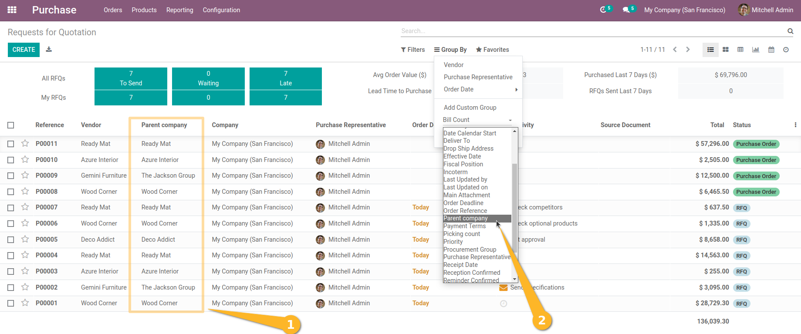
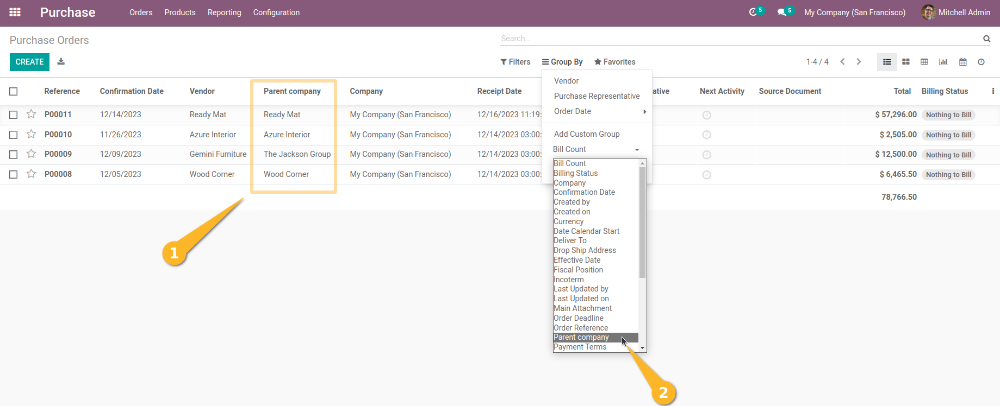

Purchase Order group by Parent Affiliate
========================================
This module allows to group by parent affiliate on purchase order.

Usage
-----
*REQUESTS FOR QUOTATION*
As a user with access to purchases (purchase.order), I see in the `Requests for Quotation` list view (Purchase > Orders > Requests for Quotation) a new column “Parent company”.
I can also group by this new field.

*PURCHASE ORDER*
With the same access, I see in the `Purchase Orders` list view (Purchase > Orders > Purchase Orders) a new “Parent company” column.

Contributors
------------
* Numigi (tm) and all its contributors (https://bit.ly/numigiens)
