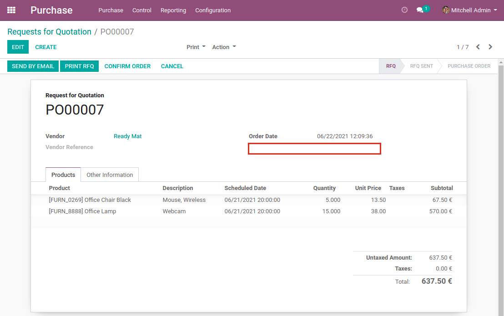
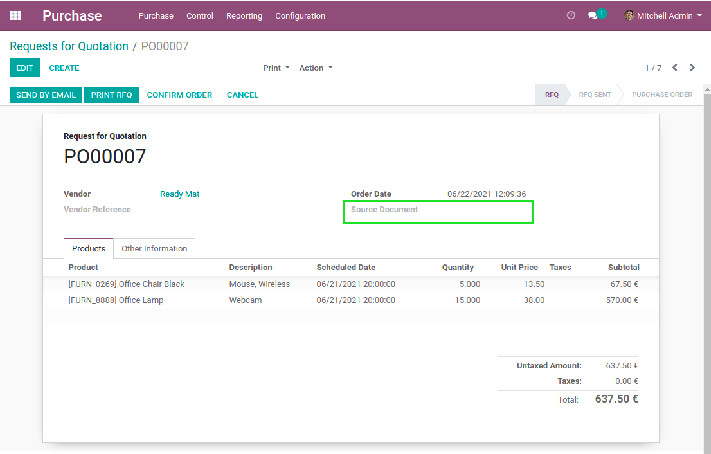

Purchase Origin Always Visible
==============================
This module makes the field ``Source Document`` visible on purchase orders.

.. contents:: Table of Contents

Context
-------
In vanilla Odoo, the field ``Source Document`` on a purchase orders is invisible if it is empty.

Usage
-----
After installing the module, the field is visible even if it is empty.

Contributors
------------
* Numigi (tm) and all its contributors (https://bit.ly/numigiens)
