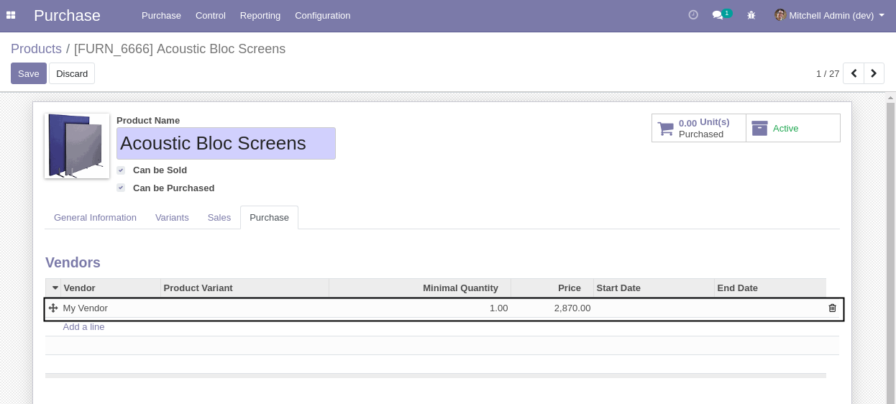
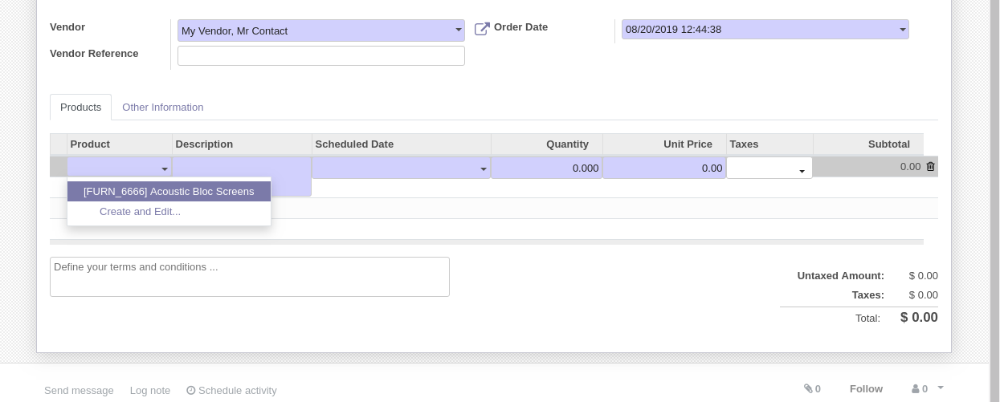
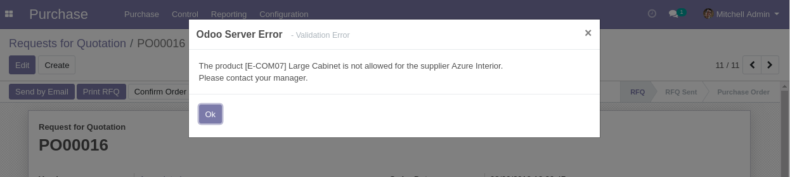

Purchase Partner Products
=========================
This module restricts the selection of products on purchase orders based on the selected supplier.

Usage
-----
As member of ``Purchase / Manager``, I go to the form view of a product.

I add a supplier to the product.

As member of ``Purchase / User``, I create a request for quotation and select a contact.

.. image:: static/description/new_purchase_order.png

I notice that the list of available products is filtered.
Only the products under the commercial entity of the selected contact are available.

Validation Constraint
---------------------
When the order is confirmed, if the supplier does not match every selected product,
a blocking error message is displayed.

Compatibility Constraint
------------------------
This module is not compatible with the purchase_product_matrix module.
The purchase_product_matrix hide the field product_id used by purchase_partner_product to filter product
and replace t with a new field : product_template_id
Link : https://github.com/odoo/odoo/blob/14.0/addons/purchase_product_matrix/views/purchase_views.xml

Contributors
------------
* Numigi (tm) and all its contributors (https://bit.ly/numigiens)
