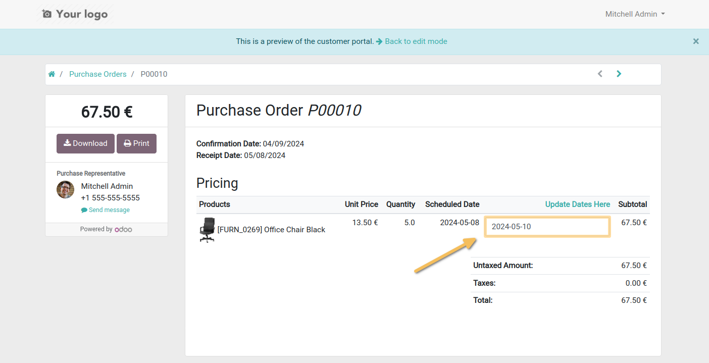
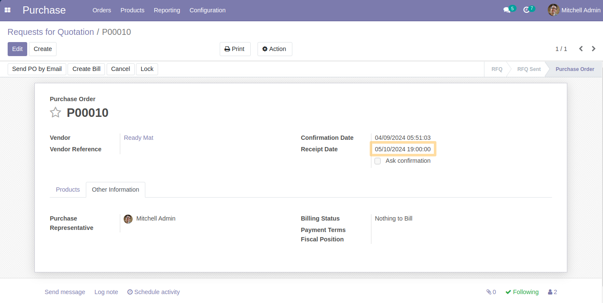

Purchase Reception Date Enhanced
================================
This module allows to have a receipt date identical to that updated by the supplier from portal view.

Usage
-----
As a supplier with portal access, I select a delivery date on Purchase portal view. 
I see that date selected will be the same as the receipt date in the Purchase Order.

*Notice*
Database always store date is in UTC time. When displayed on local browser, it will be converted to the user's timezone.
For example, if I select 2024-03-27, the date will be displayed as 2024-03-27 12:00:00 for the user located in Canada/Eastern.
So for that datetime if user is located in Shanghai UTC+8, it will be displayed as 2024-03-28 00:00:00.

Note that the rule for the convertion is according to user seller timezone, or the timezone of the company if the seller has no timezone.
Else, it will use UTC.

Contributors
------------
* Numigi (tm) and all its contributors (https://bit.ly/numigiens)
