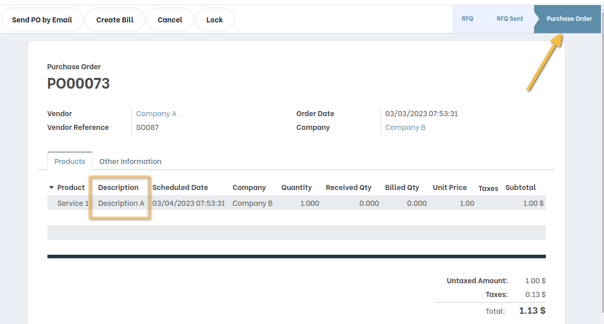
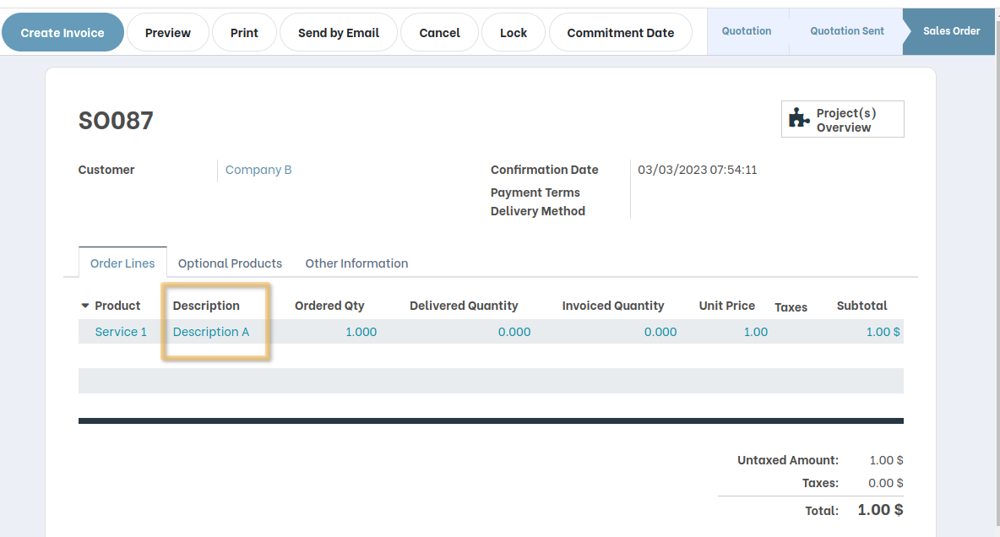

Inter Company Module for Description Line on Purchase to Sale Order
===================================================================

.. contents:: Table of Contents

Dependencies
------------

Depends on OCA Module : ``purchase_sale_inter_company``

Description
-----------

I make sur that all configuration needed on the module ``purchase_sale_inter_company`` have been done.
I activated the creation of SO from PO of multi-company.

If I create a PO with its order line, description for each product line will be kept on SO order line
after its automatique generation by approving the PO.

Contributors
------------
* Numigi (tm) and all its contributors (https://bit.ly/numigiens)
