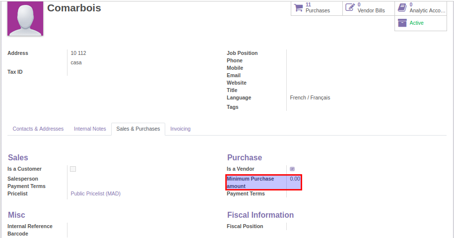
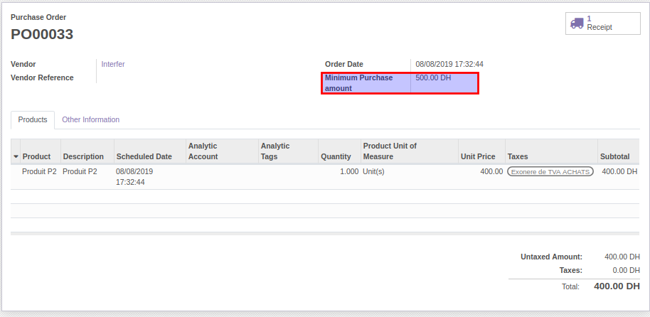
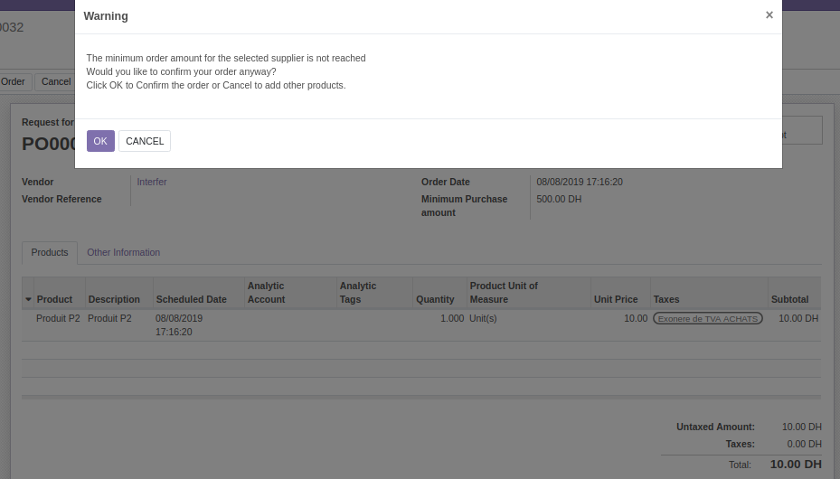

Purchase Warning Minimum Amount
===============================
This module allows to display an alert when confirming or approving Purchase Order with an untaxed amount lower than
the minimum purchase amount specified for the supplier

Configure Minimun Purchase amount for supplier
----------------------------------------------

In the form view of the supplier, a user in group purchase manager, can set the minimum purchase amount

Display minimum purchase amount in PO
-------------------------------------

The minimum purchase amount is updated when you select or when you edit the supplier

Warning when confirming PO (amount untaxed < minimum purchase amount)
---------------------------------------------------------------------

Contributors
------------
* Numigi (tm) and all its contributors (https://bit.ly/numigiens)
