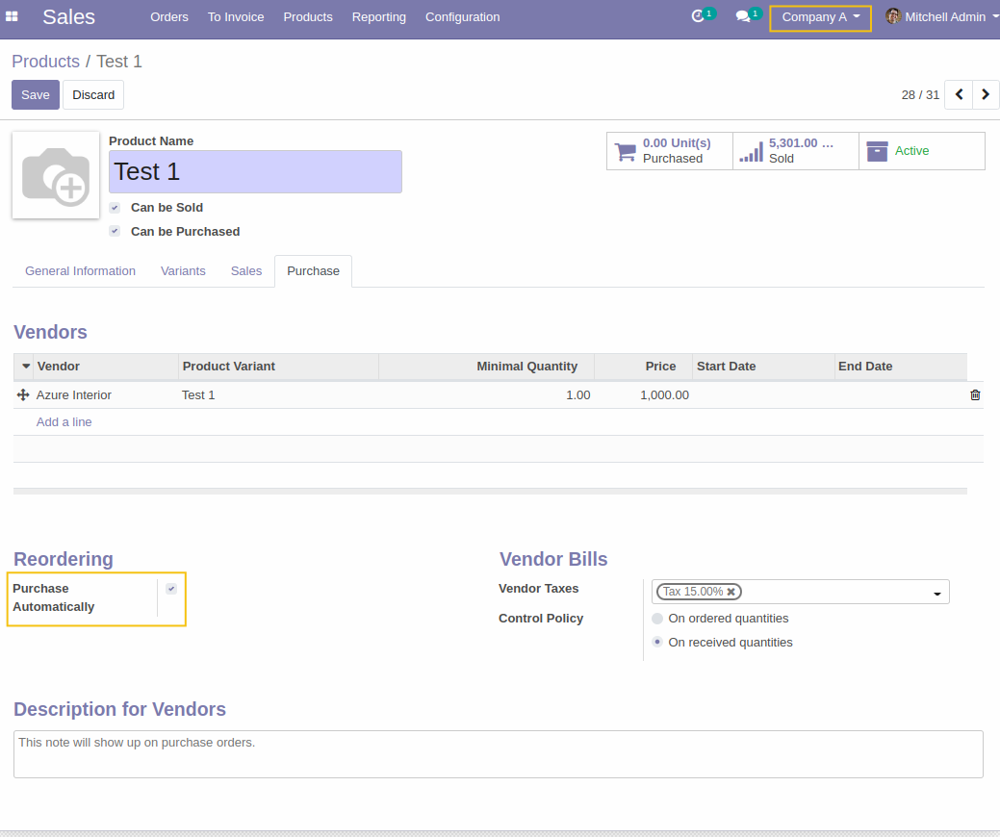
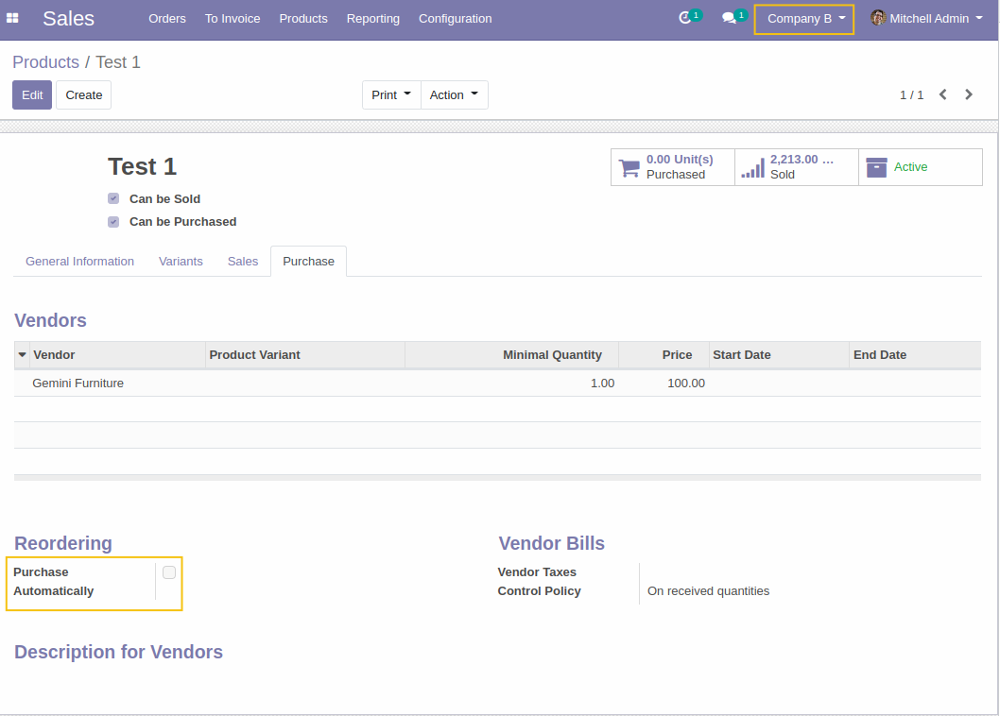

Service to purchase multi-company
=================================

This module allows to manage the automatic purchase of a service per company,
and define whether this functionality is used independently for each company.

Usage
=====

As a user with access to Company A, I create a new product of type service that can be purchased.
In the Purchases tab, I activate the purchase automatically feature.

As a user with access to Company B, I go to the form view of the same product.
I notice that the purchase automatically feature is not activated.

Contributors
------------
* Numigi (tm) and all its contributors (https://bit.ly/numigiens)
