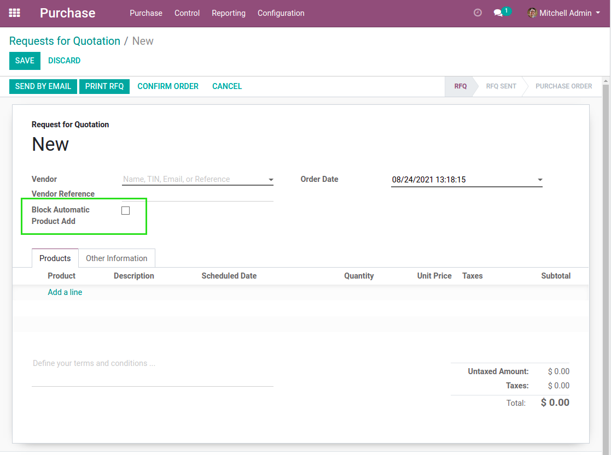

Stock Block Auto Purchase
=========================

Context
-------
In vanilla Odoo, when procurements are triggered, products that need to be resupplied
are added to draft purchase order.

This purchase order is selected based on some conditions
such as the supplier and the warehouse to resupply.

However, a draft order manually created by someone for a specific reason could be selected.
This behavior can be anoying.

Overview
--------
This module adds a checkbox on purchase orders.

When this box is checked, no product is going to be added automatically to this order
based on procurements.

Contributors
------------
* Numigi (tm) and all its contributors (https://bit.ly/numigiens)

More information
----------------
* Meet us at https://bit.ly/numigi-com
