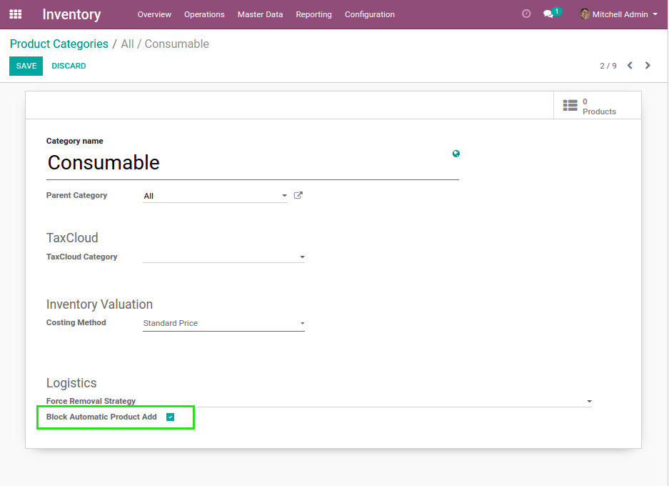
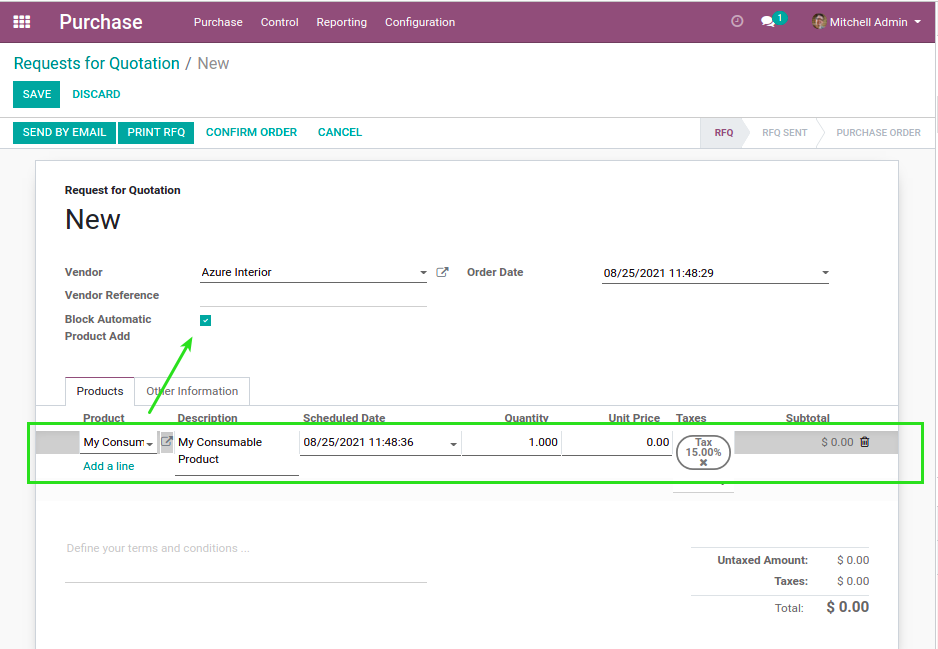

Stock Block Auto Purchase
=========================

Context
-------
In vanilla Odoo, when procurements are triggered, products that need to be resupplied
are added to draft purchase order.

This purchase order is selected based on some conditions
such as the supplier and the warehouse to resupply.

However, a draft order manually created by someone for a specific reason could be selected.
This behavior can be anoying.

Overview
--------
This module adds a checkbox on purchase orders.

.. image:: static/description/purchase_order_form.png

When this box is checked, no product is going to be added automatically to this order
based on procurements.

Advanced Configuration
----------------------
For some categories of products, you may want to always prevent the purchase order
from accepting products from automatic procurements.

On the form view of a product category, you will find a new checkbox.

If this box is checked, when the product is manually added to a purchase order,
the box will be automatically checked on the PO as well.

Contributors
------------
* Numigi (tm) and all its contributors (https://bit.ly/numigiens)

More information
----------------
* Meet us at https://bit.ly/numigi-com
