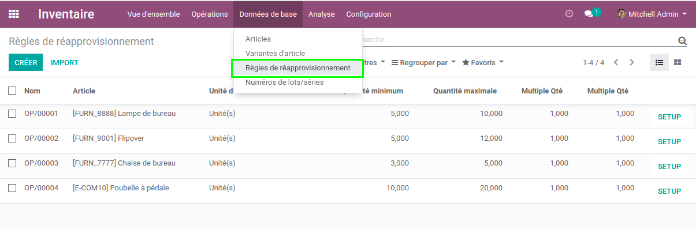
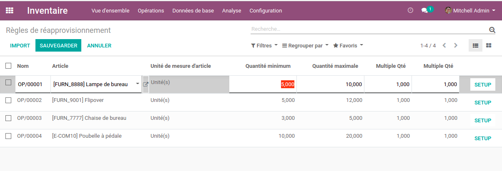
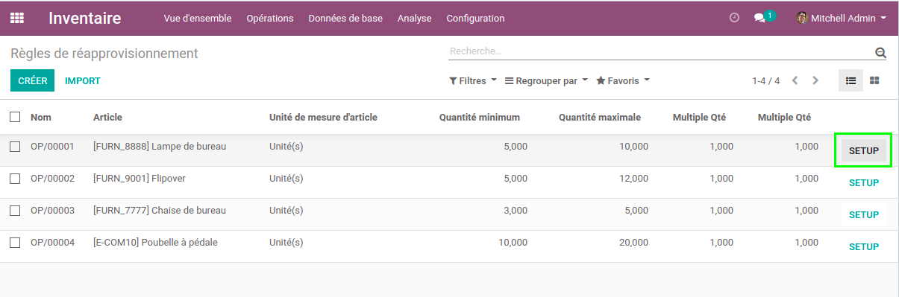
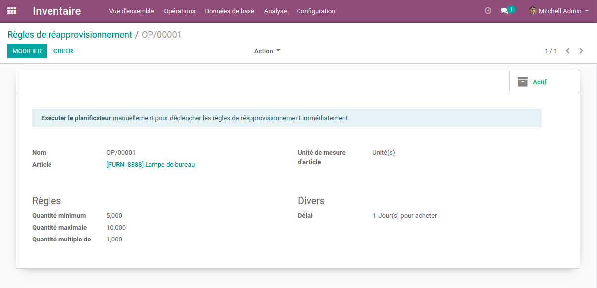

Stock Orderpoint Editable List
==============================
This module adds an editable list for reordering rules (Min / Max).

.. contents:: Table of Contents

Usage
-----
In the Inventory application, I go to the list view of reordering rules.

I notice that the view is editable.

A button is available to access the form view of a rule.

Contributors
------------
* Numigi (tm) and all its contributors (https://bit.ly/numigiens)
