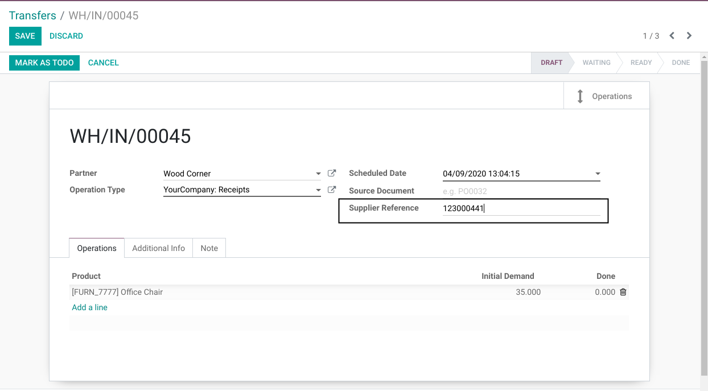
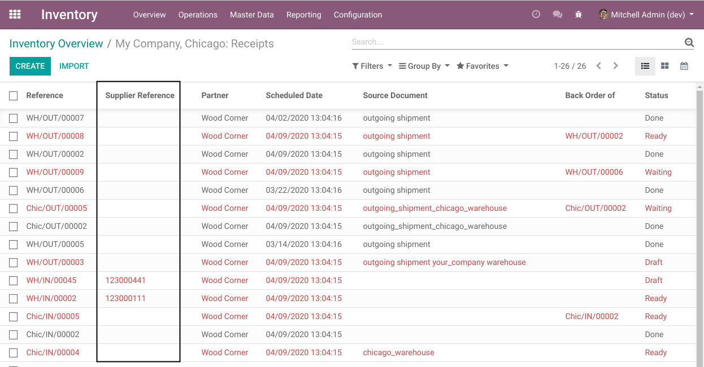
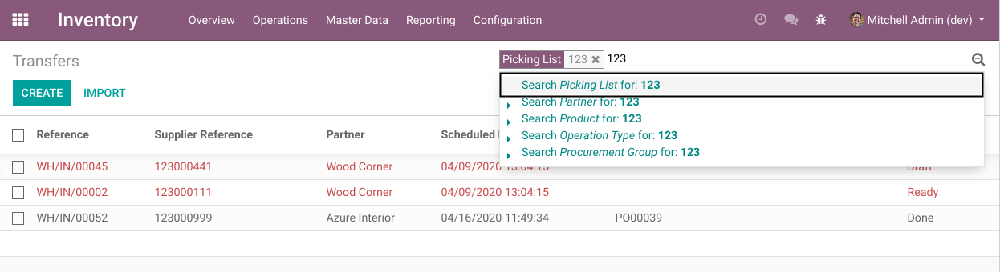
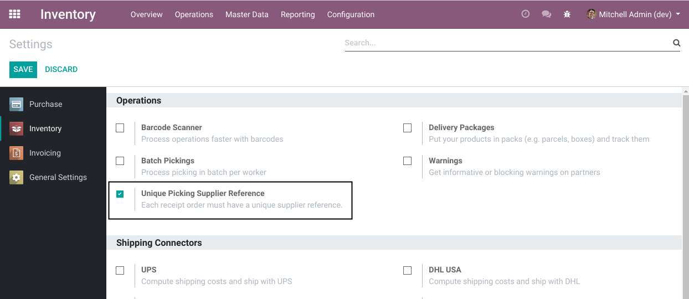

Stock Picking Supplier Reference
================================
This module adds the field ``Supplier Reference`` on stock pickings.

The field is available on list view.

When filtering the list by picking name, the system also searches for matching supplier references.

Unique Constraint
-----------------
The module allows to make the supplier reference unique per company.

To enable the constraint, go to the settings of the Inventory app and check the following box.

This enables the feature only for the company on which you are logged in.
This box needs to be checked for each relevant company.

Contributors
------------
* Numigi (tm) and all its contributors (https://bit.ly/numigiens)
